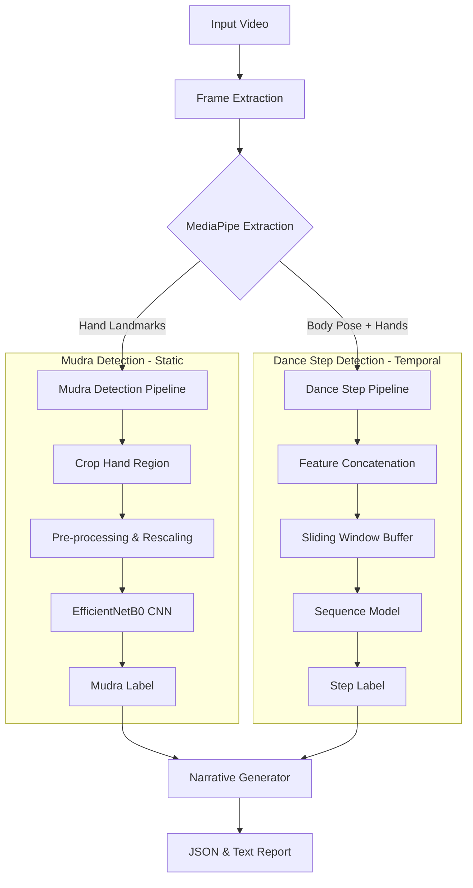
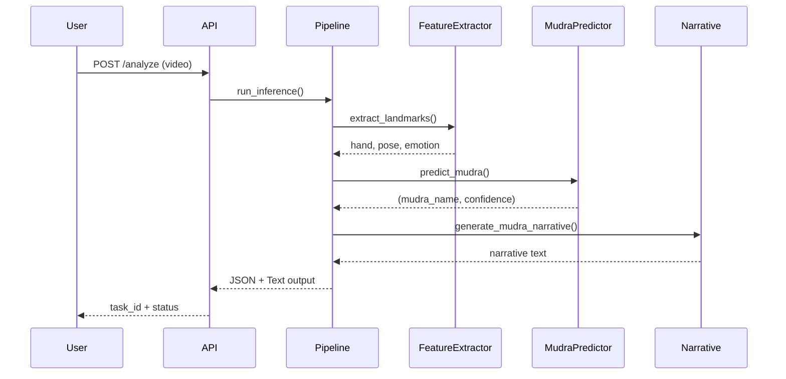

# Mudra Analysis - Bharatanatyam ML Model Project Documentation

## Table of Contents

1. [Project Overview](#project-overview)
2. [System Design](#system-design)
3. [Tools and Technologies](#tools-and-technologies)
4. [Datasets](#datasets)
5. [Implementation](#implementation)
6. [Module Development](#module-development)
7. [API Integration](#api-integration)
8. [Training Pipeline](#training-pipeline)
9. [Inference Pipeline](#inference-pipeline)

---

## Project Overview

The **Mudra Analysis ML Model** is an advanced machine learning system designed to analyze Bharatanatyam dance performances. It combines computer vision, deep learning, and natural language processing to:

- **Detect Hand Gestures (Mudras)**: Identify and classify 50+ traditional hand gestures from video frames
- **Recognize Dance Sequences**: Identify classical dance steps like Alarippu, Jathiswaram, Shabdam, Varnam, Padam, and Tillana
- **Generate Narratives**: Create human-readable descriptions and meanings of detected mudras and dance sequences

---

## System Design

### Architecture Overview

The system operates on a **dual-path architecture** that processes both static gestures (mudras) and temporal dance steps simultaneously.



### Key Components

1. **Feature Extraction Layer** (`src/extraction.py`)
   - MediaPipe Hands: 21 3D landmarks per hand (126 features for 2 hands)
   - MediaPipe Pose: 33 3D landmarks (99 features)
   - DeepFace: Emotion detection (1 feature)

2. **Mudra Classification Layer** (`src/mudra_predictor.py`)
   - EfficientNetB0 CNN (Transfer Learning)
   - Input: 224×224 RGB hand crops
   - Output: 50 mudra classes with confidence scores

3. **Dance Step Prediction Layer** (`src/inference.py`)
   - LSTM/GRU Sequence Model (planned)
   - Sliding window: 30 frames (~1 second)
   - Processes temporal patterns

4. **Narrative Generation Layer** (`src/mudra_meanings.py`, `src/narrative.py`)
   - Knowledge base of mudra meanings
   - Statistical aggregation
   - Natural language generation

---

## Tools and Technologies

### Machine Learning Frameworks

- **TensorFlow** (≥2.15.0): Deep learning framework
- **tf-keras** (≥2.18.0): High-level neural networks API
- **scikit-learn** (≥1.8.0): Classical ML algorithms and evaluation metrics

### Computer Vision

- **MediaPipe** (≥0.10.9): Real-time hand and pose landmark detection
- **OpenCV** (opencv-python ≥4.8.0): Image/video processing and manipulation

### Deep Learning & Vision

- **DeepFace** (≥0.0.79): Facial emotion recognition
- **EfficientNetB0**: Lightweight CNN for mudra classification (via TensorFlow)

### Data Processing & Analysis

- **NumPy** (≥1.24.0): Numerical computing
- **Pandas** (≥2.3.3): Data manipulation and analysis
- **joblib** (≥1.3.2): Model persistence and loading

### Visualization

- **Matplotlib** (≥3.10.8): Plotting and visualization
- **Seaborn** (≥0.12.0): Statistical data visualization

### API & Deployment

- **FastAPI** (≥0.128.0): Modern web framework for building APIs
- **Uvicorn** (≥0.40.0): ASGI server for FastAPI
- **python-multipart** (≥0.0.21): Multipart form data parsing

### Utilities

- **tqdm** (≥4.67.1): Progress bars for loops
- **psutil**: System and process monitoring (memory optimization)

### Development

- **Python** 3.9 or 3.10 (recommended for TensorFlow stability)
- **Git**: Version control
- **Render**: Cloud deployment platform

---

## Datasets

### 1. Mudra Dataset (Static Images)

#### Dataset Structure

```
data/
├── raw/
│   └── mudras/
│       ├── kaggle_50_mudras/        # Primary dataset
│       ├── asamyuktha_27/          # Single-hand mudras
│       └── barath_mudras/          # Additional collection
└── processed/
    └── mudra_features/             # Extracted features (.npy)
```

#### Kaggle 50 Mudras Dataset

- **Source**: Curated Bharatanatyam mudra imagery
- **Classes**: 50 traditional mudras (47 after filtering)
- **Format**: Raw images organized by class folders
- **Processing**: 224×224 RGB images
- **Split Ratio**: 70% train / 15% validation / 15% test

#### Mudra Categories

**Asamyuktha Hasta (Single Hand) - 28 mudras:**

- Pataka, Tripataka, Ardhapataka, Kartarimukha, Mayura
- Ardhachandra, Arala, Shukatundaka, Mushti, Shikhara
- Kapitta, Katakamukha, Suchi, Chandrakala, Padmakosha
- Sarpashirsha, Mrigashirsha, Simhamukha, Kangula, Alapadma
- Chatura, Bhramara, Hamsasya, Hamsapaksha, Sandamsha
- Mukula, Tamrachuda, Trishula

**Samyuktha Hasta (Double Hand) - 22 mudras:**

- Anjali, Kapota, Karkata, Swastika, Dola
- Pushpaputa, Utsanga, Shivalinga, Katakavardana, Kartariswastika
- Shakata, Shankha, Chakra, Samputa, Pasha
- Kilaka, Matsya, Kurma, Varaha, Garuda
- Nagabandha, Khatva, Berunda

### 2. Data Augmentation

Applied during training (3× multiplier):

1. **Horizontal Flip**: Simulates mirrored performances
2. **Rotation**: ±15 degrees for wrist variation tolerance
3. **Brightness Adjustment**:
   - Brighter: +20% HSV Value channel
   - Darker: -20% HSV Value channel

### 3. Video Dataset (Temporal Sequences)

- **Location**: `sample videos/` directory
- **Format**: MP4, AVI, MOV, MKV, WEBM
- **Processing**: Frame extraction every 3 seconds
- **Target FPS**: 30 frames per second
- **Sequence Length**: 30 frames (~1 second window)

---

## Implementation

### Module Development

#### 1. Configuration Management (`src/config.py`)

**Purpose**: Centralized configuration for all pipeline components

**Key Constants:**

```python
# Paths
BASE_DIR, DATA_DIR, MODEL_DIR
RAW_MUDRAS_DIR, PROCESSED_MUDRAS_DIR
MUDRA_MODEL_PATH, STEP_MODEL_PATH

# Feature Extraction
N_HAND_LANDMARKS = 21
N_POSE_LANDMARKS = 33
FEATURES_HAND_DIM = 126  # 21 × 3 × 2 (hands)
FEATURES_POSE_DIM = 99   # 33 × 3

# Training Hyperparameters
MUDRA_IMAGE_SIZE = (224, 224)
BATCH_SIZE = 32
EPOCHS = 100
LEARNING_RATE = 0.001
VALIDATION_SPLIT = 0.15
EARLY_STOPPING_PATIENCE = 15

# Inference
INFERENCE_INTERVAL_SECONDS = 3.0
SEQUENCE_LENGTH = 30
```

#### 2. Feature Extraction (`src/extraction.py`)

**Class**: `FeatureExtractor`

**Capabilities:**

- MediaPipe Hands: Detects up to 2 hands, extracts 21 3D landmarks per hand
- MediaPipe Pose: Extracts 33 body pose landmarks
- DeepFace: Analyzes facial emotions (7 categories)
- Hand cropping: Extracts bounding box regions for CNN input

**Key Methods:**

```python
def extract_landmarks(image_rgb):
    """Returns: hand_features, pose_features, emotion_id, hand_crops"""

def extract_hand_landmarks(image_rgb):
    """Returns 126D vector (2 hands × 21 points × 3 coords)"""

def extract_pose_landmarks(image_rgb):
    """Returns 99D vector (33 points × 3 coords)"""

def extract_emotion(image):
    """Returns emotion_id (0-6) using DeepFace"""
```

#### 3. Mudra Classification (`src/mudra_predictor.py`)

**Class**: `MudraPredictor`

**Architecture:**

- **Base Model**: EfficientNetB0 (pre-trained on ImageNet, fine-tuned)
- **Input**: 224×224×3 RGB images
- **Output Layer**: Dense(num_classes=50, activation='softmax')
- **Additional Layers**: GlobalAveragePooling2D, Dropout(0.2)

**Model Loading Priority:**

1. `kaggle_model_v3.keras` (latest Keras format)
2. `kaggle_model_v3.h5` (H5 format)
3. `kaggle_model_v3_savedmodel` (SavedModel format)
4. Fallback to older versions or Random Forest

**Preprocessing Pipeline:**

```python
1. Hand Cropping:
   - Detect hand bounding box from landmarks
   - Center-crop with 50% margin
   - Square crop with edge replication padding

2. Image Preprocessing:
   - BGR → RGB conversion
   - Resize to 224×224
   - Convert to float32 (no manual scaling, model has Rescaling layer)

3. Inference:
   - Batch dimension: (1, 224, 224, 3)
   - Use SavedModel signature or standard Keras predict()
   - Return top-k predictions with confidence scores
```

#### 4. Data Processing (`src/processing.py`)

**Augmentation Functions:**

```python
def horizontal_flip(image):
    """Mirror flip for left/right hand variations"""

def rotate_image(image, angle):
    """Random rotation ±15° for wrist angle tolerance"""

def adjust_brightness(image, factor):
    """HSV brightness adjustment ±20%"""
```

**Dataset Processing:**

- Loads images from class folders
- Applies augmentation (3× multiplier)
- Extracts MediaPipe landmarks
- Saves as .npy feature vectors

#### 5. Mudra Knowledge Base (`src/mudra_meanings.py`)

**Data Structures:**

```python
MUDRA_MEANINGS = {
    "Pataka": "Flag - represents cloud, forest, ocean, denial, or a sword",
    "Anjali": "Prayer - represents prayer, offering, salutation",
    # ... 50+ mudras with meanings
}

MUDRA_CATEGORIES = {
    "single_hand": [...],  # 28 mudras
    "double_hand": [...]   # 22 mudras
}
```

**Functions:**

```python
def get_mudra_meaning(mudra_name: str) -> str
def get_mudra_category(mudra_name: str) -> str
def generate_mudra_narrative(mudra_detections: list) -> str
```

#### 6. Inference Engine (`src/inference.py`)

**Class**: `StepPredictor`

**Components:**

- Dance step classification (mock/placeholder for LSTM)
- Mudra prediction integration
- Temporal aggregation

**Function**: `run_inference(video_path, output_json_path, use_mudra_model=True)`

**Pipeline:**

```python
1. Video Loading:
   - Load video with OpenCV
   - Extract FPS and total frames
   - Process every 3 seconds (uniform intervals)

2. Frame Processing Loop:
   for each interval frame:
       a. Extract features (hand, pose, emotion)
       b. Predict mudra (if enabled)
       c. Buffer features for sequence model
       d. Predict dance step

3. Output Generation:
   - JSON with temporal timeline
   - Mudra detections with confidence
   - Dance step segments
   - Mudra summary statistics
```

**Output Format:**

```json
{
  "video_path": "path/to/video.mp4",
  "total_frames": 1500,
  "fps": 30.0,
  "dance_steps": [
    {
      "step": "Alarippu",
      "start_frame": 0,
      "end_frame": 90,
      "meaning": "Opening invocation..."
    }
  ],
  "mudra_detections": [
    {
      "frame": 0,
      "label": "Anjali",
      "confidence": 0.95
    }
  ],
  "mudra_summary": {
    "Anjali": 15,
    "Pataka": 12
  }
}
```

#### 7. Narrative Generation (`src/narrative.py`)

**Purpose**: Convert detection data into human-readable stories

**Function**: `generate_storyline(inference_output)`

**Narrative Components:**

1. Overall performance summary
2. Top 5 most prominent mudras with meanings
3. Category distribution (single-hand vs double-hand)
4. Temporal flow description

---

## Training Pipeline

### Module: `src/train_mudra_model.py`

**Class**: `MudraTrainer`

**Training Process:**

```python
1. Data Loading:
   - Load processed .npy feature files
   - Create train/val/test splits (stratified)
   - ImageDataGenerator for augmentation

2. Model Construction:
   base_model = EfficientNetB0(
       weights='imagenet',
       include_top=False,
       input_shape=(224, 224, 3)
   )
   x = GlobalAveragePooling2D()(base_model.output)
   x = Dropout(0.2)(x)
   output = Dense(num_classes, activation='softmax')(x)

3. Training Configuration:
   - Optimizer: Adam (learning_rate=0.001)
   - Loss: Sparse Categorical Crossentropy
   - Metrics: Accuracy, Top-3, Top-5

4. Callbacks:
   - Early Stopping (patience=15)
   - Model Checkpoint (save best)
   - ReduceLROnPlateau (patience=7)
   - TensorBoard logging

5. Evaluation:
   - Confusion Matrix
   - Classification Report (Precision/Recall/F1)
   - Top-k accuracy metrics
```

**Training Script Execution:**

```bash
python main_pipeline.py --mode train_mudra --model_type hybrid
```

---

## API Integration

### FastAPI Server (`api.py`)

**Endpoints:**

#### 1. Health Check

```http
GET /
Response: {"status": "online", "message": "Mudra Analysis API is active."}
```

#### 2. System Status

```http
GET /status
Response: {
  "status": "healthy",
  "jobs_tracked": 5,
  "app_memory_mb": 512.3,
  "lock_active": false
}
```

#### 3. Video Analysis

```http
POST /analyze
Content-Type: multipart/form-data

Parameters:
- file: Video file (MP4, AVI, MOV, MKV, WEBM)
- use_mudra: boolean (default: true)

Response: {"task_id": "uuid", "status": "pending"}
```

#### 4. Result Retrieval

```http
GET /result/{task_id}
Response: {
  "task_id": "uuid",
  "status": "completed",
  "data": { ... inference output ... }
}
```

**Key Features:**

- **Background Processing**: Asynchronous task queue
- **Concurrency Control**: Threading lock for sequential processing
- **Memory Optimization**: Singleton model instances (lazy loading)
- **Resource Cleanup**: Automatic temp file deletion

**Deployment:**

```bash
uvicorn api:app --host 0.0.0.0 --port 8000
```

**Production Deployment** (Render):

```yaml
# render.yaml
services:
  - type: web
    name: mudra-analysis-api
    env: python
    buildCommand: "pip install -r requirements.txt"
    startCommand: "uvicorn api:app --host 0.0.0.0 --port $PORT"
```

---

## Code Integration

### Main Pipeline (`main_pipeline.py`)

**Modes of Operation:**

1. **Inference Mode** (Primary Use Case):

```bash
python main_pipeline.py --mode inference --video_path "sample videos/sample1.mp4"
```

Output: `sample1_inferred.json`, `sample1_mudra_story.txt`

2. **Dataset Processing**:

```bash
python main_pipeline.py --mode process_mudras
```

Processes raw images → extracts features → saves .npy files

3. **Model Training**:

```bash
python main_pipeline.py --mode train_mudra --model_type landmark
```

4. **Dataset Verification**:

```bash
python main_pipeline.py --mode verify_datasets
```

### Workflow Integration



---

## Performance Optimizations

1. **Frame Skipping**: Process every 3 seconds (configurable)
2. **Singleton Models**: Reuse loaded models across requests
3. **Memory Profiling**: psutil monitoring
4. **Batch Processing**: Efficient tensor operations
5. **Model Quantization**: Future optimization for edge deployment

---

## Future Enhancements

1. **LSTM/GRU Implementation**: Replace mock step predictor
2. **Real-time Streaming**: WebSocket support for live analysis
3. **Multi-camera Support**: Fuse multiple viewpoints
4. **Mobile Deployment**: TensorFlow Lite conversion
5. **Expanded Dataset**: More dance forms and regional variations

---

## References

- [MediaPipe Hands Documentation](https://google.github.io/mediapipe/solutions/hands.html)
- [EfficientNet Paper](https://arxiv.org/abs/1905.11946)
- [Bharatanatyam Mudras](https://en.wikipedia.org/wiki/Mudra)
- [TensorFlow Best Practices](https://www.tensorflow.org/guide)

---

**Project Repository**: [Mudra-Analysis-backend-model](https://github.com/Aashish17405/Mudra-Analysis-backend-model)

**Author**: Aashish  
**Last Updated**: January 2026  
**License**: MIT (assumed)
